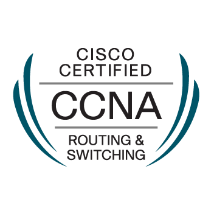
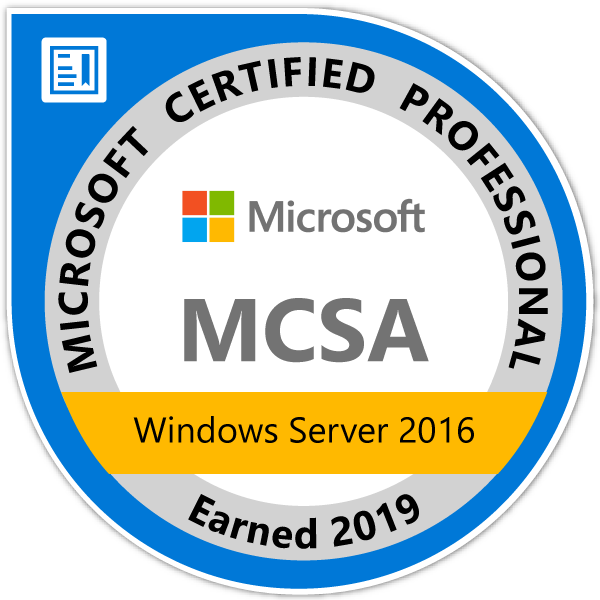

# Hi there 👋 I'm Prageeth :computer:
- 🎓 First-Class Graduate from the University of Sri Jayewardenepura, specialized in Networking Technology.
- 🖥️ IT Operations Engineer at Atlas Populi (Pvt) Ltd.
- 🎓 Currently pursuing an MSc in Cybersecurity at Sri Lanka Institute of Information Technology (SLIIT).
- 🎙️ Passionate about teaching and tutoring, with experience in private tutoring.
- 🌐 Cisco and Microsoft Certified.
- 🔐 Research interests include user authentication, cybersecurity education, and the human factor in cybersecurity.
- 🚴 Loves traveling around Sri Lanka, especially exploring scenic uphill areas.
- 🎥 Big fan of movies and music! Feel free to ask me for recommendations.
- 📧 Reach me at: prageethfndo@gmail.com
- 🤓 Always learning and exploring!
- :suspect: Dmithri

<h2>Badges</h2>

<h3>Connect on</h3>

